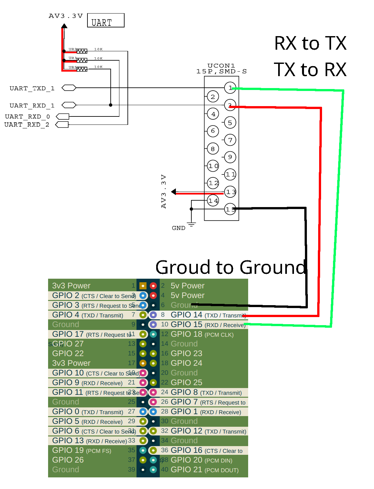
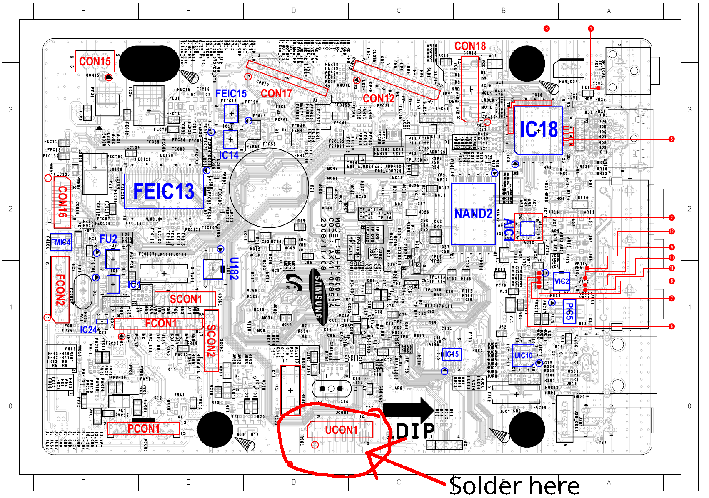
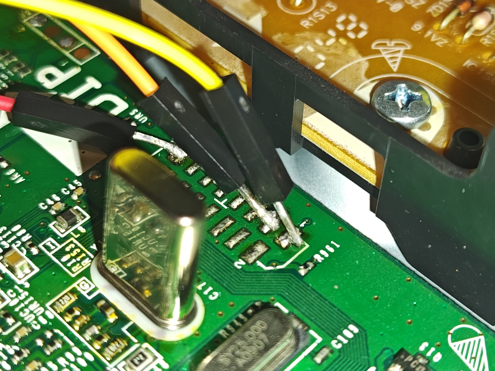

# The BD-P3600 hacker's guide: A path to persistence and homebrew

> [!CAUTION]
> This guide assumes your are:
> 1. Capable of basic soldering
> 2. Poses a general knowledge of Linux
> 3. Not afraid to **BRICK YOUR Blue-ray player!** 
<center> <h2> 👹 !!! You can damage your player, so think twice before you go forward PLEASE!!!!! 👹 </h2></center>

> [!WARNING]
> The purpose of this guide is **not** for that of piracy, but rather homebrew and general shenanigans. 

Another guide can be found [here](https://www.avforums.com/threads/hacking-samsung-bd-p1620a-bd-p3600.1245419/) on AVForums, although I found it to be lacking in many respects. Although it is still a useful resource. 
A guide for a similar model can be found [here](https://forum.samygo.tv/viewtopic.php?p=10052#p10052).


## Part 0: Required supplies
1. A soldering iron
2. Something capable of UART (A Raspberry PI is what I am using)
3. An Ethernet cable with a router to plug it into
4. 4 male to female jumper wires compatible with being attached to the raspberry pi

## Part 1: Obtaining UART
For those unaware, UART ([Universal asynchronous receiver-transmitter](https://en.wikipedia.org/wiki/Universal_asynchronous_receiver-transmitter)) is a basic serial protocol that allows you to obtain a simple TTY, and lucky the BD-P3600 has easily accessible UART pins! 

To start out with, you need to set up the raspberry pi over ssh on wifi, as a million tutorials for this exist I will leave it as an exercise to the reader/google.

**THE RASPBERRY PI  DOES NOT HAVE UART ENABLED BY DEFAULT** to set it up see [step 1.5](step%201.5%20setting%20up%20the%20pi.md)

After the raspberry pi has UART enabled, you need to solder to the correct pins. Use this diagram to know where to solder to!



If you ignore my horrible solder job, here it what it should look like!

if you did everything right, and it passes the smoke test, you've got yourself all you need on the hardware side!

To test out and make sure it works, run on your pi the command to view the UART then turn on the player! If your lucky you should see a boot-log spray onto the screen. You might need to first install minicom using apt.  

```bash
minicom -b 115200 -o -D /dev/ttyS0
```
(Depending on the raspberry pi version, you might need to try `/dev/ttyAMA0`, `/dev/serial0`, `/dev/serial1`, or `/dev/AMA0`. See https://spellfoundry.com/2016/05/29/configuring-gpio-serial-port-raspbian-jessie-including-pi-3-4/)

If still nothing happens, check your connections, and use a multi-meter to make sure you didn't bridge any of the pins you shouldn't have
## Part 2: Logging in and making a copy of the firmware

There are two methods to login to the BD-P3600, and if your anything like me you will probably need both. 

### Method 1: Logging in the "proper" way
1. Boot the Blu-ray player and press **CTRL+C**.  
2. Log in with:  
   - **Username:** `root`  
   - **Password:** `tkfkddlf` (This appears to reference a Korean pop song; confirmation is inconclusive.)  

### Method 2: Via the boot loader in single user mode
1. Spam **CTRL+C** during boot to access the bootloader (`CFE>` prompt). If you miss it, reboot and try again.  
2. View the default boot command using `printenv`. For example:  

   ```bash
   splash -480p;boot -z -elf flash0.kernel: 'root=/dev/romblock2 memcfg=384 console=1,115200n8 BDVD_BOOT_AUTOSTART=y ro'
   ```

3. Modify the command to enable single-user mode and write access:  

   ```bash
   boot -z -elf flash0.kernel: 'root=/dev/romblock2 memcfg=384 console=1,115200n8 BDVD_BOOT_AUTOSTART=y single rw'
   ```

4. Run the modified command to boot into the OS.  
5. Mount the proc filesystem:  

   ```bash
   mount -t proc none /proc
   ```

---


After playing around for a while, you might notice that the entire OS (apart from the pstor) is  ephemeral, meaning any saved changes are reverted upon reboot, even if the write protection is disabled.

Either way, once you are in the OS, the **FIRST THING TO DO** is to dumping the firmware for safety. It is best to do your own, as it is likely unique to your device, and other peoples might not work for you!

To extract the firmware, you need a `fat32` formatted USB flash drive. 

It appears to me you can only write to the flash drive using the second login method (single user mode) with write protection disables, so I will be using that for the guide. 

After you are logged, and have mounted the proc with the command above, plug in your flash drive. And wait until you see something like this:
```plaintext
sda: assuming drive cache: write through  
	sda:  
Attached scsi removable disk sda at scsi4, channel 0, id 0, lun 0  
Attached scsi generic sg1 at scsi4, channel 0, id 0, lun 0,  type 0
```
The `sda` here is the device file we will be using. I like to use the `/var` directory for the usb when using the second method, as it is not doing anything right now. Mount the USB drive with the following (Otherwise with the "proper" login method `/etc/` is writable, so make a dir and mount to that):
```bash
mount /dev/sda /var
```
Replace `sda` with whatever device file it gives you, its not always `sda`!


Now to view what partitions exits cat out `/proc/mtd`
```
# cat /proc/mtd  
dev:    size   erasesize  name  
mtd0: 00180000 00004000 "cfe"  
mtd1: 00500000 00004000 "vmlinux"  
mtd2: 02800000 00004000 "rootfs"  
mtd3: 007fc000 00004000 "pstor"  
mtd4: 00140000 00004000 "splash"  
mtd5: 00020000 00004000 "drmregion"  
mtd6: 000c0000 00004000 "rawnvr"  
mtd7: 00004000 00004000 "macadr"  
mtd8: 00020000 00004000 "nvram"  
mtd9: 00640000 00004000 "swap"  
mtd10: 04000000 00004000 "all"
```
**DO NOT EVER WRITE THE `cfe` or `all`!**

To extract the firmware you can use the `dd` command, and store these files in a safe place. These are the commands I used:
```bash
dd if=/dev/mtdblock0 of=/var/cfe.bin
dd if=/dev/mtdblock1 of=/var/vmlinux.bin
dd if=/dev/mtdblock2 of=/var/rootfs.bin
dd if=/dev/mtdblock3 of=/var/pstor.bin
dd if=/dev/mtdblock4 of=/var/splash.bin
dd if=/dev/mtdblock5 of=/var/drmregion.bin
dd if=/dev/mtdblock6 of=/var/rawnvr.bin
dd if=/dev/mtdblock7 of=/var/macadr.bin
dd if=/dev/mtdblock8 of=/var/nvram.bin
dd if=/dev/mtdblock9 of=/var/swap.bin
dd if=/dev/mtdblock10 of=/var/all.bin

sync # Make sure all data is copied to the flash drive
umount /var
```
**Note**: The `nanddump` command adds extra error correction that make the resulting files invalid. 


## Part 3: Modifying the rootfs to gain persistence

The `rootfs` is internally as a `Squashfs filesystem, little endian, version 3.0`, which is a quite old, and outdated version. So old in fact, the old version of squashfs-tools needed to create them is incompatible with modern versions of gcc, as such it needs to be installed inside of docker. 

I have included my `Dockerfile` that can be used to extract, modify, and pack a new `rootfs`. Download this (or clone this repo) and navigate to the directory in the terminal. Then build the docker image with the following command:
```bash
docker build -t squashfs-tools .
```
Navigate to where you have a copy of the rootfs, then use this command to run squashfs-tools and mount the directory:
```bash
docker run -it -v $(pwd):/mnt squashfs-tools
```
From within the container, extract the fs:
```bash
cp /mnt/ROOTFS.BIN .
unsquashfs ROOTFS.BIN
```
At this point you can modify the rootfs anyway you want, the only thing I did was add a startup hook. You can use my `rcS.patch` file to do the changes for you, just put it the same directory as your rootfs (so the docker container can see it) and apply the patch:
```bash
patch /workspace/squashfs-root/etc/init.d/rcS /mnt/rcS.patch
```

Or just edit the `rcS` file yourself:
```bash
vi /workspace/squashfs-root/etc/init.d/rcS
```
And add the following bellow the default (unused) user script on line 418.
```bash
# A user script in the persistent storage.  
if [ -f /mnt/pstor/startup.sh ]; then  
   [ "$BQ" ] || echo "rcS: Source /mnt/pstor/startup.sh"  
   . /mnt/pstor/startup.sh  
  
   if [ $? -eq 105 ]; then # 0x69 in decimal is 105  
       echo "rcS: Error code 0x69 detected. Skipping the rest of the script."  
       exit 0 # Do not return an error code.  
   fi  
fi
```

After all your changes are done, you can repack the rootfs:
```bash
# In the docker container:
mksquashfs squashfs-root/ /mnt/newrootfs.bin
# Exit the docker container
# And on your machine give yourself permision over it:
sudo chown $(whoami) newrootfs.bin
```

## Part 4:  Flashing the new rootfs

This step is a bit dodgy, and took me about a week to figure out. First of all, you cannot flash a new rootfs while it is in use, so you need to do this from within the bootloader. Second, the bootloader (from my experience) cannot mount a USB flash drive, so the only option is to use a [TFTP](https://en.wikipedia.org/wiki/Trivial_File_Transfer_Protocol) server over Ethernet. Lastly, if the file you are flashing is greater than about ten megabytes, you get an IO error, so breaking up the file first is a must. 

**Note**: The method used on [AVForums](https://www.avforums.com/threads/hacking-samsung-bd-p1620a-bd-p3600.1245419/) of booting over NFS seems not to work, and unnecessary when flashing from the bootloader is supported.  

To set up TFTP, on a Debian(including the Raspberry PI) based distro use the following commands.
```bash
sudo apt-get install tftpd-hpa
nano /etc/default/tftpd-hpa
```
Paste the following into `/etc/default/tftpd-hpa`
```plaintext
TFTP_USERNAME="tftp"
TFTP_DIRECTORY="/srv/tftp"
TFTP_ADDRESS="0.0.0.0:69"
TFTP_OPTIONS="--secure"
```
Setup permissions:
```bash
sudo mkdir -p /srv/tftp
sudo chmod -R 777 /srv/tftp

# Get your new rootfs into the tftp dir
cp newrootfs.bin /srv/tftp

# Restart tftp
sudo systemctl restart tftpd-hpa

# Get your local ip
ifconfig
```
Now split up the modified rootfs into 5 megabyte chunks:
```bash
cd /srv/tftp
split -b 5242880 modfs.bin chunk_
```


At this point, plug the BD-P3600 into the router with the Ethernet cable, then get into the bootloader. To player the rootfs, use these commands:
```bash
# Enable networking
CFE> ifconfig eth0 -auto
# Understand the flash layout
CFE> show devices

# Clear the old rootfs
CFE> flasherase flash0.rootfs

# Flash the rootfs
CFE> flash -noerase -noheader -offset=0 192.168.1.77:chunk_aa flash0.rootfs
CFE> flash -noerase -noheader -offset=5242880 192.168.1.77:chunk_ab flash0.rootfs
CFE> flash -noerase -noheader -offset=10485760 192.168.1.77:chunk_ac flash0.rootfs
...
```
Generate your commands using the following python code:
```python
LOCALIP = "192.168.1.69" # Replace with your own IP
CHUNKCOUNT = 16

for i in range(CHUNKCOUNT):
	print(f"flash -noerase -noheader -offset={i*5242880} {LOCALIP}:chunk_a{chr(ord('a')+i)} flash0.rootfs")
```

Now boot into OS using your boot command and hope for the best! To verify the boot hook, you can check out the `rcS` file in `vi`, and scroll down until you find it.
```bash
vi /etc/init.d/rcS
```

If its there, you are mostly done!

## Part 5: Writing a user script

Since the `pstor` partition is not ephemeral, you can do what ever you want there. Simply create and write a `/mnt/pstor/startup.sh` file with what ever programs you want, and exit with the 105 exit code to prevent the default program from being executed. The following is what I have:
```bash
vi /mnt/pstor/startup.sh
```
Contents:
```bash
# Startup networking with a known ip
ifconfig eth0 192.168.1.10 up  
# Enable telnet
telnetd  
  
# Something funny to make me laugh
echo HACKED DVD PLAYER
```

Reboot and reap the rewards! With telnet you can remove the pi!