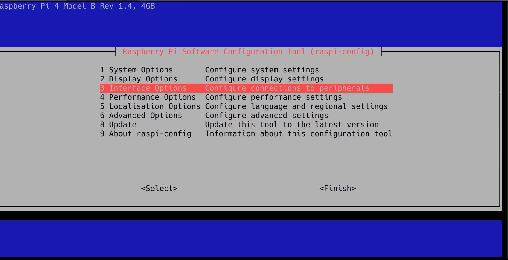
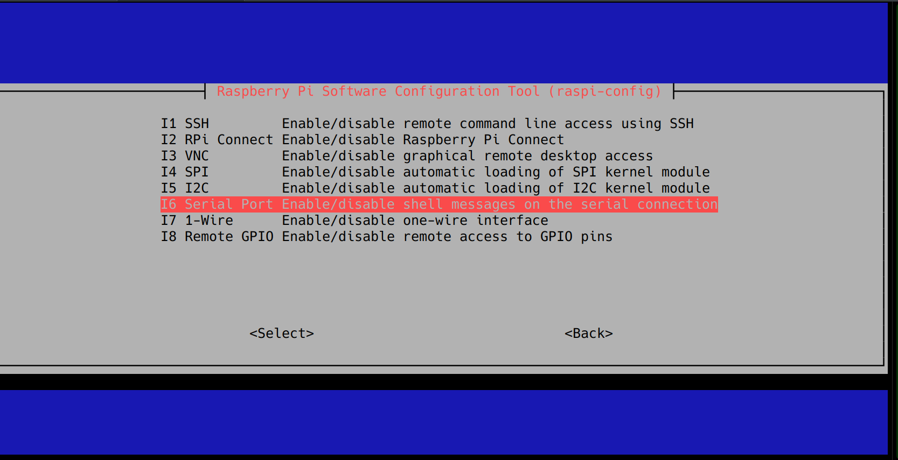
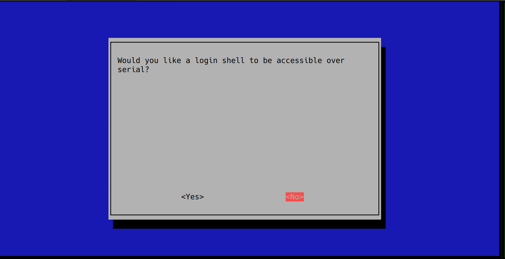
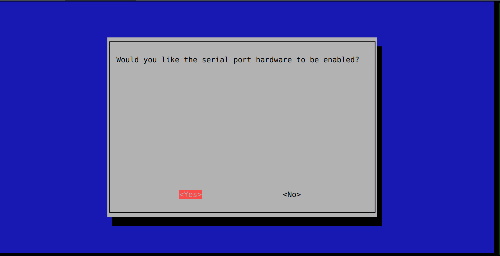

## Enabling UART on the pi

First, enter the config cli with:
```bash
sudo raspi-config
```

Interface options

Serial port

Select **NO** to the shell being accessible over serial

And select **YES** to the serial port hardware to be enabled

And finally give it a quick reboot, and it should be enabled!
```bash
sudo reboot
```
